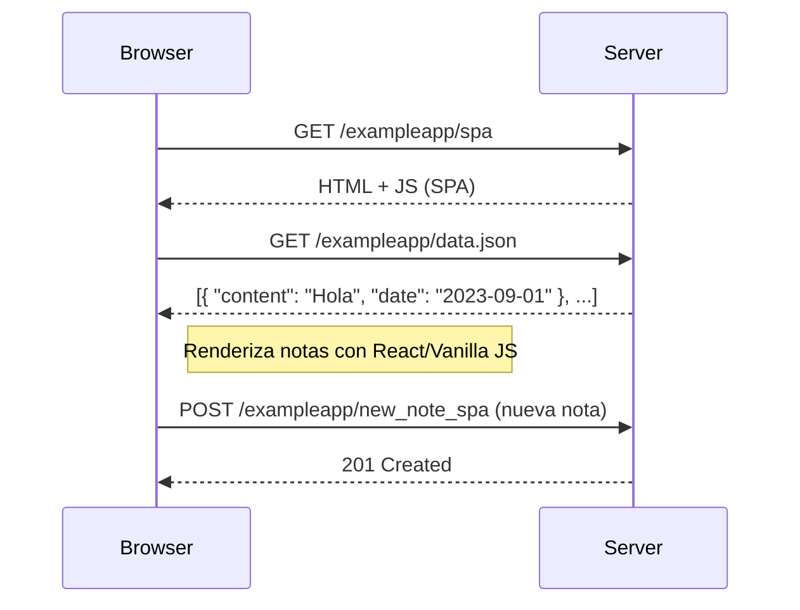

```mermaid
sequenceDiagram
    participant Browser
    participant Server

    Browser->>Server: GET /exampleapp/spa
    Server-->>Browser: HTML + JS (SPA)
    Browser->>Server: GET /exampleapp/data.json
    Server-->>Browser: [{ "content": "Hola", "date": "2023-09-01" }, ...]
    Note right of Browser: Renderiza notas con React/Vanilla JS
    Browser->>Server: POST /exampleapp/new_note_spa (nueva nota)
    Server-->>Browser: 201 Created
```
